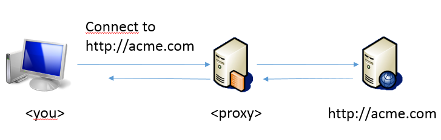

# HTTP/HTTPs Proxy basics

An HTTP/HTTPS proxy (such as *ZScaler*) sits between your computer and the internet. Its role is to check all outbound connections, possibly log them and even forbid some of them (+ other features depending on the proxy).

Therefore, all your applications that need to connect to the internet have to be informed that they need to `CONNECT` to that proxy first. For this, you will first have to collect information about your proxy, as explained [here](./know_your_proxy).
