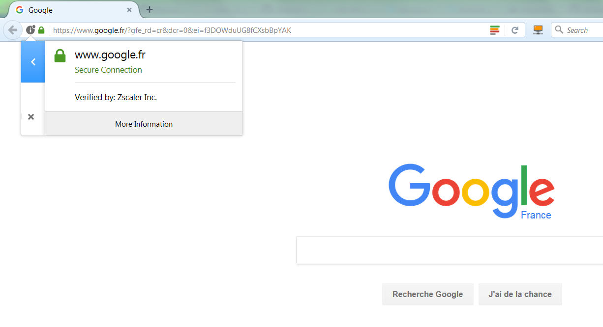

# Know your proxy

Before configuring your computer applications to work with your proxy, you have to know which configuration settings to apply.

## Basics

These can typically be obtained from your IT department:

* the proxy's **host** and **port** for the two protocols (HTTP and HTTPs). For example `http://proxyhost:8080` and `https://proxyhost:4443`
* the **list of hosts that do not require a proxy**, in other words the hosts for which the applications should still use a direct connection. These are typically computers located in the intranet, but also some external hosts that have been put in a 'whitelist' by your IT department. For example `localhost,127.0.0.1,mylocalserver`
* (optional) your credentials (**username** and **password**). Note that NTML proxies such as ZScaler do not require this - this is even dangerous in term of security to write your username and password in a file or an environment variable, so we don't recommend it


## Auto-configuration scripts

Some tools are able to get their configuration with "auto-config" from a `.pac` script. If your organization provides such a script, make sure that you retrieve it.


## Advanced: proxies that modify the SSL certification chain

Some proxies such as *ZScaler* modify the SSL certification chain by replacing the root Certification Authority (CA)'s certificate signature with their own CA certificate. 

In these cases, you will have to tell all your software applications to **trust** this new CA certificate. We will see below how to do that, but first let's check if you need it with your proxy.

### Check if your proxy needs to be trusted

To check if your proxy changes the certification chain, here is the procedure on *Firefox* (but you can probably find equivalent possibilities in other browsers):
 
* connect to any https page such as [https://google.com](https://google.com)
* click on the small 'locker' icon at the left of the URL bar
* extend the popup. It should state "secure connection, verified by `xxx`":



* if `xxx` has the name of your proxy (in this example, *Zscaler*) instead of being a known certification authority (such as DigiCert, Thawte, Verisign, Symantec, etc.), that means that your proxy has modified the certification chain. Otherwise, that means that either your proxy does not modify it, or bad luck : you picked a site that is in the whitelist :) select another https url and try again, to be sure. 

### Download your proxy's root certificate

If the test was positive, you will need to download the proxy's CA certificate in order to be able to trust it. For this:

* Click on `More Information > View Certificate > Details`. 


* Select the ROOT certificate, at the top of the hierarchy - not the intermediate ones ! - and export it as a `*.crt` or `*.cer` file. If your browser asks you which certificate format is needed, select `base64`. This format is a string representation of the certificate's bytes, so you may open the file in Notepad and copy/paste the certificate easily if you need to.

You now have a `my_proxys_root_ca_cert.cer` file. 

*Note: `.cer`, `.crt` and `.pem` are both valid extensions for such a `base64` encoded file, see [this article](https://support.ssl.com/Knowledgebase/Article/View/19/0/der-vs-crt-vs-cer-vs-pem-certificates-and-how-to-convert-them). They can be opened with a text editor if needed.*

### Create a certificate bundle including your proxy's root certificate

As we'll see in the next session, some tools are able to support addition of trusted certificates one by one (= separate certificate files), while some others only support changing the whole trusted certificate bundle entirely (= a single file containing all trusted certificates). 

You will therefore need to build such a certificate bundle file. This is done by appending your proxy's root certificate (`my_proxys_root_ca_cert.cer`, downloaded in previous section) to an **existing** certificate bundle.

* Get an existing certificate bundle. For example you may wish to get it from [certifi](https://certifi.io/en/latest/) by downloading it from this adress: [certs.pem](https://mkcert.org/generate/). **IMPORTANT** please check that this link is still the link recommended by certifi.io! Downloading a compromised list of certificate authorities can enfringe your computer's (and IT dept) security rules, proceed with care and/or double-check with your IT department.
* save the file somewhere on your computer, and rename it for example `160117-certifi-ca-bundle-with-proxy.pem`. Make sure that only administrator account has write permissions on this file. This will prevent programs to add other trusted certificates later on.
* open it in your favorite text editor to edit it: at the end of the file, append your Proxy's certificate (the contents of the `my_proxys_root_ca_cert.cer` file downloaded in previous step). The bottom of the resulting certificate bundle file should therefore now look like this:
 
```text
(... end of the certs.pem file provided by certifi)
oyi3B43njTOQ5yOf+1CceWxG1bQVs5ZufpsMljq4Ui0/1lvh+wjChP4kqKOJ2qxq
4RgqsahDYVvTH9w7jXbyLeiNdd8XM2w9U/t7y0Ff/9yi0GE44Za4rF2LN9d11TPA
mRGunUHBcnWEvgJBQl9nJEiU0Zsnvgc/ubhPgXRR4Xq37Z0j4r7g1SgEEzwxA57d
emyPxgcYxn/eR44/KJ4EBs+lVDR3veyJm+kXQ99b21/+jh5Xos1AnX5iItreGCc=
-----END CERTIFICATE-----

My Proxy's Root CA
==================
-----BEGIN CERTIFICATE-----
MIAE07CCA7ugAwIBAgIJANu+mC2Jt3uTMA0GCSqGSIb3DQEBCwUAMIGhMQswCQYD
VQQGEwJVUzETMBEGA1UECBMKQ2FsaWZvcm5pYTERMA8GA1UEBxMIU2FuIEpvc2Ux
(... this is fairly long)
xFNjavxrHmsH8jPHVvgc1VD0Opja0l/BRVauTrUaoW6tE+wFG5rEcPGS80jjHK4S
pB5iDj2mUZH1T8lzYtuZy0ZPirxmtsk3135+CKNa2OCAhhFjE0xd
-----END CERTIFICATE-----
```

You are now all set :

* You have a `my_proxys_root_ca_cert.crt` file containing your proxy's certificate only. This will be referred to as `<path_to_root_ca_cert.crt>` in next section
* You have a `160117-certifi-ca-bundle-with-proxy.pem` file containing a bundle of trusted certificates, as well as your proxy's. This will be referred to as `<path_to_ca_bundle.pem>` in next section

*(Remember that `.crt`, `.cer` and `.pem` are both valid extensions for these files)*